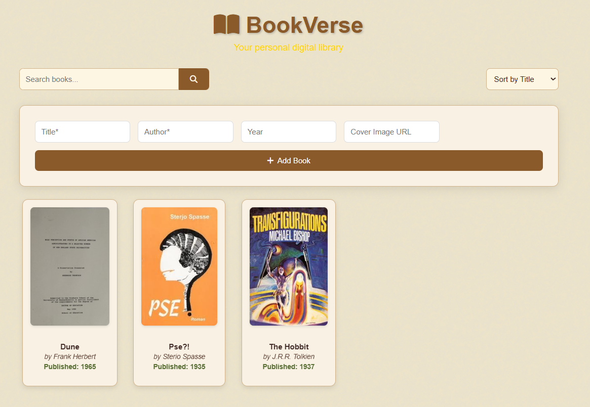

> Goal
    The goal of this project was to show the skills i've learned in this semester and to apply basic understanding of how a web app works and is developed (This ofcourse includes Html, Css, Javascript for the frontend and Python (Flask) and SQLite for the backend). The web aplications allows users to store, delete and search for books in their library.

> How to run:
1. Make sure you have Python downloaded on your device
2. open the terminal and write the command "python app.py" in the terminal.
3. Click the link it provides, usually something like: http://127.0.0.1:5000  

